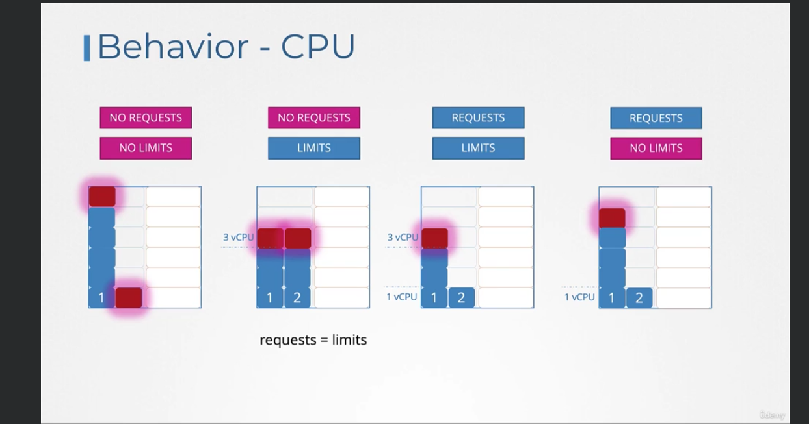
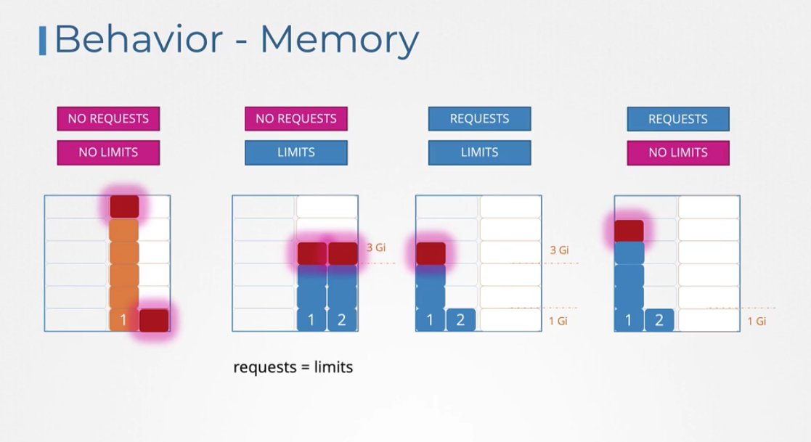

- Kube-schedule
    - schedule the pods on the nodes where resouces are available
    - you can add resouces limits to the pods
    - like 1m means cpu = 1 milicup
    - like 256Mi means
    - you can use G or Gi means G 1000 gaga-bytes
    - we can limits the resouces to the pods by using the limst
        - if the cpu limit exceedded than show cpu throllted
        - if you memory limits exceed than pod restart with OOM
    - by default no request and limits so the pods can consume as much as wanted
    - if you set the limts than request will be the same
    - if you set the both request and limts it will use max of the limits
    - if you set the request than it will use no limits its will do as needed
    - in case memory using by as pod the only way to kill the pod to relase the memory

    - we can set the default limits by using the kind : LimitRagne on namespace level
    - We can create resouce quota on namespace level by using the kind: resoucequotata 

Full picture of the limits CPU

Full picture of the limits memory

